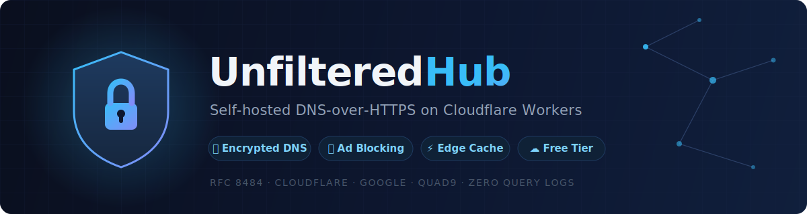

<div align="center">



<br>

[](https://workers.cloudflare.com/)
[](tsconfig.json)
[](test/)
[](https://datatracker.ietf.org/doc/html/rfc8484)
[](LICENSE)

**English** · [Türkçe](README.tr.md)

[Quick Start](#quick-start) · [Features](#features) · [Free Tier Budget](#cloudflare-free-tier-budget) · [Security Model](#security-model) · [Architecture](#architecture)

</div>

---

A self-hosted DNS-over-HTTPS proxy on Cloudflare Workers that encrypts your DNS queries, blocks ads and trackers, and gives you full control over your DNS resolution.

## What It Does

UnfilteredHub sits between your devices and upstream DNS resolvers. Every DNS query from your device travels over HTTPS to your own Cloudflare Worker, which resolves it through one of three upstream providers (Cloudflare, Google, Quad9), applies ad/tracker blocking, caches the result, and returns it encrypted.

- Accepts DNS queries via RFC 8484 (JSON and wireformat, GET and POST)
- Blocks ~300 embedded ad/tracker/malware domains, extensible via KV
- Caches responses using Cloudflare Cache API with upstream TTL awareness
- Selects the fastest upstream resolver using adaptive latency scoring
- Protects against DNS abuse (rate limiting, DGA detection, dangerous query blocking)
- Runs on Cloudflare's edge network (300+ locations, free tier)

## What It Does NOT Do

- **Does not provide anonymity.** Your Worker runs on your Cloudflare account. Cloudflare can see your queries. This encrypts the link between your device and the Worker, preventing ISP/network-level DNS inspection.
- **Does not log individual queries.** Daily aggregate counters (total, blocked, cached) are stored if KV is configured. No per-domain or per-IP query logs exist.
- **Does not filter content.** The blocklist targets advertising, tracking, and malware infrastructure. It does not block categories of websites.
- **Does not replace a VPN.** DNS encryption hides which domains you look up. Your ISP still sees the IP addresses you connect to afterward.
- **Does not guarantee uptime.** It depends on Cloudflare Workers availability and the three upstream resolvers.

## Features

| Category | Feature | Details |
|----------|---------|---------|
| **DNS Proxy** | RFC 8484 DoH | JSON (`?name=&type=`) and wireformat (`?dns=`, POST) |
| **DNS Proxy** | Multi-upstream failover | Cloudflare DNS, Google DNS, Quad9 with adaptive EMA scoring |
| **DNS Proxy** | DNSSEC pass-through | AD flag preserved from upstream; DO flag forwarded and cache-isolated |
| **Blocking** | Embedded core blocklist | ~300 domains (ads, trackers, malware, crypto miners, telemetry) |
| **Blocking** | KV snapshot blocklist | Single-key snapshot, loaded to memory every 5 min — zero per-query KV reads |
| **Blocking** | Allowlist override | `@domain` entries always resolve, even if a parent is blocked |
| **Blocking** | Subdomain matching | `ads.example.com` blocked if `example.com` is in the list |
| **Cache** | JSON **and wireformat** | Both `?name=` and `?dns=`/POST paths cached (real DoH clients use wireformat) |
| **Cache** | DNS transaction ID rewrite | Cached wire responses are re-stamped with each client's own query ID |
| **Cache** | TTL from upstream | Positive: clamped 60s–3600s; negative (NXDOMAIN/NODATA): 30s–300s |
| **Cache** | DNSSEC-aware keys | `do` and `cd` flags are part of the cache key to prevent AD flag mismatch |
| **Abuse** | Per-IP rate limiting | 200 queries/min, **in-memory** (zero KV cost), 5-min block on exceed |
| **Abuse** | DGA detection | Shannon entropy + vowel heuristic on leftmost label |
| **Abuse** | Dangerous type blocking | ANY, CHAOS, oversized TXT refused with RCODE=5 |
| **Stats** | Buffered daily counters | Exact in-memory counts, flushed to KV at most every 5 min per isolate |
| **UI** | Landing page | Dark theme, TR/EN, feature showcase, live impact widget |
| **UI** | Setup wizard | 3-step guide with QR code, device detection, connection test |
| **UI** | Admin dashboard | Login, stats cards, 7-day chart, KV blocklist CRUD |
| **UI** | Blocklist viewer | Paginated, searchable, export as TXT/JSON |
| **UI** | Transparency page | Public system status: resolvers, scores, policies, blocklist size |
| **UI** | /whoami diagnostic | Hashed client ID, resolver, cache, abuse flag, country |
| **Profiles** | Apple .mobileconfig | One-tap DoH setup for iOS/iPadOS/macOS |
| **Profiles** | Android guide + config | DNS stamp, app configs (Intra, Nebulo), manual instructions |
| **Admin** | API key auth | X-API-Key header, constant-time compare, optional HMAC-SHA256 |
| **Admin** | IP whitelist | Optional ADMIN_ALLOWED_IPS restriction |
| **Admin** | Brute-force protection | 10 failed attempts/5min triggers IP block |

## Quick Start

**Prerequisites:** Node.js 18+, a free [Cloudflare account](https://dash.cloudflare.com/sign-up).

```bash
# 1. Clone and install
git clone https://github.com/hamzaciftci/unfiltered-hub.git
cd unfiltered-hub && npm install

# 2. Run the tests (optional but recommended)
npm test

# 3. Authenticate with Cloudflare
npx wrangler login

# 4. Deploy
npx wrangler deploy
```

Your Worker URL will be printed:

```
Published unfilteredhub-doh
  https://unfilteredhub-doh.YOUR-ACCOUNT.workers.dev
```

Test it:

```bash
curl 'https://unfilteredhub-doh.YOUR-ACCOUNT.workers.dev/dns-query?name=example.com&type=A'
```

**Optional — enable KV for extended blocklist and stats:**

```bash
npx wrangler kv namespace create BLOCKLIST
# Add the returned ID to wrangler.toml under [[kv_namespaces]]
npx wrangler secret put ADMIN_KEY
# Enter a strong key (min 16 chars — e.g. openssl rand -hex 32).
# Weak/default keys (test-secret-123, changeme, password, ...) are
# REJECTED at runtime: the admin API stays disabled until a real
# secret is set. Never put ADMIN_KEY in wrangler.toml.
npx wrangler deploy
```

**Local development secrets:** copy `.dev.vars.example` to `.dev.vars` and
fill in `ADMIN_KEY`. `.dev.vars` is gitignored; `wrangler dev` picks it up
automatically. Production always uses `wrangler secret put ADMIN_KEY`.

## Cloudflare Free Tier Budget

This project is explicitly engineered to fit the Workers free tier:

| Limit (free tier) | Budget | How it's respected |
|---|---|---|
| 1,000 KV **writes**/day | Stats flush only | Abuse/rate-limit: 0 writes (in-memory). Stats: buffered, ≤1 write / 5 min / isolate (~288/day worst case). Admin ops: 1 write per mutation. |
| 100,000 KV **reads**/day | 1 read / 5 min / isolate | Blocklist is a single snapshot key cached in memory; DNS queries never read KV directly. |
| 100,000 requests/day | — | Typical personal DoH usage: 5–20k queries/day; the Cache API absorbs repeats. |
| 10 ms CPU/request | — | Hot path is Set lookups + header parsing. Snapshot parse (~30k domains) happens once per 5 min in the background (stale-while-revalidate). Keep the imported snapshot ≤ ~30k entries (`MAX_DOMAINS` in the import script). |

Trade-offs made for the free tier (documented, deliberate):
- Rate limiting is **per-isolate**: an attacker spread across many PoPs gets N× the per-minute cap. Each isolate still blocks independently, and KV's ~60s eventual consistency made the old KV-based limiter no stricter in practice.
- Stats are **eventually written**: an isolate that dies before its 5-minute flush loses that buffer (undercount, never overcount).
- Blocklist changes propagate to all isolates **within 5 minutes** (the snapshot TTL); the isolate serving the admin request updates instantly.

## Security Model

**Threat model:** Prevent network-level observers (ISPs, public Wi-Fi operators) from seeing DNS queries in plaintext.

**What is encrypted:**
- Device to Worker: HTTPS (TLS 1.3 on Cloudflare edge)
- Worker to upstream: HTTPS (Cloudflare/Google/Quad9 DoH endpoints)

**What is NOT encrypted:**
- Worker execution context — Cloudflare processes queries in cleartext within the isolate
- IP addresses of resolved domains — visible to the network after DNS resolution

**Authentication layers (Admin API):**

| Layer | Mechanism | Purpose |
|-------|-----------|---------|
| 1 | Rate limiting | 10 failed auth / 5 min, 100 total / 10 min per IP |
| 2 | IP whitelist | Optional `ADMIN_ALLOWED_IPS` env var |
| 3 | API key | `X-API-Key` header, constant-time comparison |
| 4 | HMAC signatures | Optional `X-Timestamp` + `X-Signature`, 5-min replay window |

Query-parameter auth (`?key=`) is explicitly rejected to prevent key leakage in access logs.

**KV failure behavior:** All DNS-critical paths fail-open. If KV is unavailable, the extended blocklist snapshot and stats are skipped but DNS resolution continues using the embedded core blocklist. Rate limiting is unaffected — it is fully in-memory.

## Abuse Protection

The `/dns-query` endpoint is public. Three layers protect against misuse:

**Layer 1 — Dangerous query blocking.** ANY queries (amplification vector), CHAOS class queries (info disclosure), and oversized TXT queries (>2048 bytes) are refused with DNS RCODE=5 (REFUSED).

**Layer 2 — DGA detection.** Domain labels are checked for bot-generated patterns:
- Labels >25 characters with zero vowels
- Labels >10 characters with Shannon entropy >3.5

DGA-flagged queries are allowed but marked `suspicious`. They are not blocked on first occurrence.

**Layer 3 — Per-IP rate limiting (in-memory).** Per-isolate counters enforce:
- 200 queries/min hard cap — exceed triggers a 5-minute IP block
- 3 suspicious queries/min — exceed triggers a 5-minute IP block

Blocked IPs receive HTTP 429 with `Retry-After` header.

**Why in-memory instead of KV?** KV allows only 1,000 writes/day on the free
tier — a per-query counter burns through that in hours and silently disables
protection. KV is also eventually consistent (~60s), which makes sub-minute
windows unreliable anyway. In-memory buckets are exact within an isolate,
cost nothing, and a given client IP is routed to the same PoP in practice.
Memory is bounded (10k tracked IPs per isolate, LRU eviction).

All abuse responses use DNS REFUSED (RCODE=5), not NXDOMAIN, so clients can distinguish "query refused" from "domain does not exist."

## Transparency Philosophy

UnfilteredHub exposes its internals to users rather than hiding them.

- `/transparency` — Public page showing all active resolvers, their live scores, abuse protection thresholds, cache policy, and blocklist sources. No authentication required.
- `/blocklist` — Full searchable, paginated view of every domain in the core blocklist. Export as TXT or JSON.
- `/whoami` — Connection diagnostic showing hashed client ID (SHA-256, first 12 hex chars — never the real IP), active resolver, cache status, abuse flag, and country.
- `/api/impact` — Live stats JSON (total queries, blocked, cache rate, abuse prevented, avg latency) used by the landing page widget. Returns `available: false` when KV is down instead of fabricating numbers.
- `X-Resolver`, `X-Resolver-Score`, `X-Cache`, `X-Abuse-Flag` headers on every DNS response.

Admin API keys, IP whitelists, and KV internal keys are never exposed through any public endpoint.

## Architecture

```
                         ┌─────────────────────────────────────────────┐
                         │            Cloudflare Worker                │
                         │                                             │
  ┌────────┐   HTTPS     │  ┌─────────┐    ┌──────────┐               │
  │ Device ├────────────►│  │  Router  ├───►│  Abuse   │               │
  └────────┘             │  │ index.ts │    │  Check   │               │
                         │  └────┬────┘    └────┬─────┘               │
                         │       │              │                      │
                         │  ┌────▼────┐    ┌────▼─────┐               │
                         │  │  Block  │    │  Cache   │               │
                         │  │  Check  │    │  Lookup  │               │
                         │  └────┬────┘    └────┬─────┘               │
                         │       │              │                      │
                         │       │         ┌────▼──────────────┐      │
                         │       │         │ Adaptive Resolver │      │
                         │       │         │ (EMA scoring)     │      │
                         │       │         └────┬──────────────┘      │
                         │       │              │                      │
                         └───────┼──────────────┼──────────────────────┘
                                 │              │
                      NXDOMAIN   │              │  HTTPS
                      (blocked)  │              │
                                 │    ┌─────────▼─────────┐
                                 │    │  Cloudflare DNS    │
                                 │    │  Google DNS        │
                                 │    │  Quad9             │
                                 │    └───────────────────┘
                                 │
                    ┌────────────▼────────────┐
                    │ Response flow:          │
                    │  1. Blocklist → NXDOMAIN│
                    │  2. Cache → HIT         │
                    │  3. Upstream → resolve   │
                    │  4. Cache write (bg)     │
                    │  5. Stats record (bg)    │
                    └─────────────────────────┘
```

**Source layout:**

```
src/
├── index.ts           Router, DNS handler orchestration
├── resolver.ts        Multi-upstream with adaptive EMA scoring
├── blocker.ts         Domain matching, NXDOMAIN response builders
├── blocklist.ts       Embedded ~300-domain Set
├── abuse.ts           In-memory rate limiting, DGA detection, type blocking
├── cache.ts           Cache API read/write (JSON + wireformat, ID rewrite)
├── dnsWire.ts         DNS wireformat parse/build helpers (question, TTL, EDNS)
├── stats.ts           Buffered KV counters (flush every 5 min)
├── utils.ts           Shared: escHtml, getClientIp, detectLang, DNS headers
├── admin.ts           Admin API routing (stats, blocklist CRUD)
├── adminAuth.ts       Auth pipeline (API key, HMAC, IP whitelist)
├── rateLimiter.ts     Admin brute-force protection
├── dashboard.ts       Admin dashboard HTML/JS
├── landing.ts         Landing page with impact widget
├── impactWidget.ts    Live stats widget (HTML/CSS/JS)
├── whoami.ts          /whoami endpoint (JSON + HTML)
├── transparency.ts    /transparency endpoint
├── blocklistViewer.ts /blocklist paginated viewer
├── setup.ts           Setup wizard with QR code encoder
├── apple-profile.ts   iOS/macOS .mobileconfig generator
└── android-profile.ts Android guide, DNS stamp, JSON config
```

## Limitations

- **Cloudflare Workers free tier**: 100,000 requests/day, 10ms CPU/request, 1,000 KV writes/day. Sufficient for personal use (one household). Not designed for public resolver scale. See the *Cloudflare Free Tier Budget* section for how each limit is respected.
- **No KV = reduced features**: Without KV configured, the extended blocklist snapshot and persisted stats are disabled. Rate limiting (in-memory), the core embedded blocklist, caching, and upstream resolution all still work.
- **Rate limiting is per-isolate**: In-memory counters are exact within one isolate but not shared globally. A distributed attacker gets a multiple of the per-minute cap; each isolate still blocks independently.
- **Android Private DNS limitation**: Android's native Private DNS uses DNS-over-TLS (DoT), which Cloudflare Workers cannot serve. Android users must use app-level DoH (Chrome, Firefox, Intra) or the setup wizard's guide.
- **No manual cache purge endpoint**: Cached DNS entries expire naturally via TTL (positive 60s–3600s, negative 30s–300s). There is no admin endpoint to force-purge a cached entry. Newly blocked domains stop resolving immediately (the blocklist is checked before the cache), but unblocked domains may serve a cached answer until TTL expiry.
- **Stats undercount slightly**: Counters buffer in memory and flush every 5 minutes; an isolate that dies before flushing loses its buffer. Counts are exact otherwise (no sampling).
- **Blocklist propagation delay**: Snapshot changes reach all isolates within the 5-minute snapshot TTL.

## Production Checklist

See [PRODUCTION_CHECKLIST.md](PRODUCTION_CHECKLIST.md) for a detailed review of:

- Worker request limits and CPU time estimation
- KV failure behavior (fail-open vs fail-closed) for every component
- Cold start impact and memory usage
- Rate limit threshold analysis
- DGA false positive risk assessment
- Cache invalidation edge cases
- DNSSEC AD flag consistency

## License

[MIT](LICENSE)
